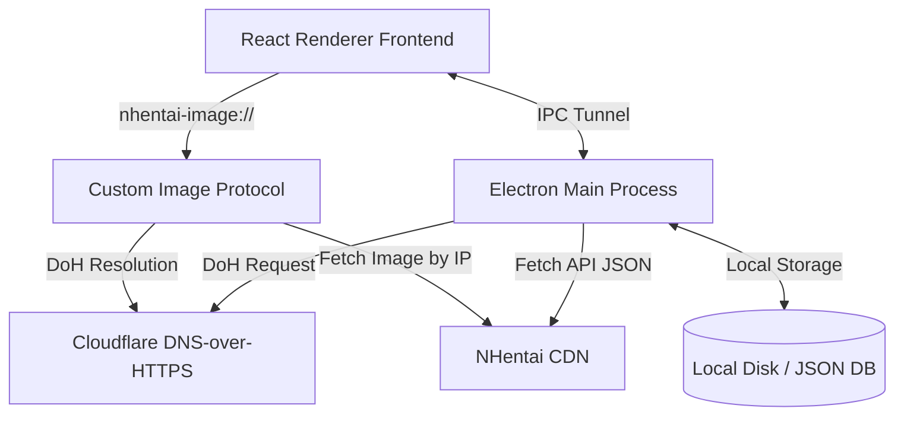

# Product Requirements Document (PRD) - NClientV3 Desktop Clone

This document details the product requirements and technical architecture for the **NClientV3 Desktop Clone**, an unofficial desktop client for NHentai based on the Android client `maxwai/NClientV3`.

---

## 1. Architectural Design

The application consists of two primary components:
1. **Electron Main Process (Backend)**: Handles OS-level operations (disk I/O for downloads, settings) and network requests. Bypasses DNS blocks via built-in DNS-over-HTTPS (DoH) and custom network routing.
2. **React Frontend (Renderer)**: Styled with custom Vanilla CSS for premium aesthetics (glassmorphism, clean layouts, and smooth transitions).

---

## 2. Core Feature Requirements

The desktop client supports all core features from the NClientV3 Android application plus desktop-specific optimizations:

1. **Browse Main Page**:
   - List recent galleries on the home screen.
   - Display cards showing the cover thumbnail, title (customizable format), page count, and language.
   - **Popular Now**: Prominently display a horizontal scrolling carousel of 5 currently trending galleries on page 1 of the home feed.

2. **Advanced Numbered Pagination**:
   - Dynamic page number buttons instead of simple Next/Prev buttons.
   - Include quick navigation controls: "First" (jump to page 1) and "Last" (jump to the final page).

3. **Search Mechanics**:
   - Integrated search bar to filter by custom query tags.
   - Support search exclusion operators (e.g., `-tagname`).
   - **Direct Numeric ID Search**: If the search query consists entirely of digits (e.g. `392812`), the client bypasses search list filters and routes/displays that specific doujin detail card directly.

4. **Interactive Doujin ID Badges**:
   - **Card Badge**: A floating glassmorphism ID badge (e.g., `#123456`) displays on the top-left of each cover image in list views. Clicking the badge instantly copies the ID to the system clipboard and flashes a green checkmark success feedback, blocking click propagation so the detail page isn't opened.
   - **Detail Badge**: A prominent copyable ID badge is shown directly above the manga titles in the detail view.

5. **Aesthetic Enhancements & Global Modals**:
   - Short-hand counts for favorites (e.g. `1000` to `1K`, `15400` to `15.4K`).
   - Custom obsidian dark theme with glassmorphism overlays and smooth transitions. Customizable light and amoled black themes available in settings.
   - **Global Confirmation Modal**: Fully custom confirmation modal rendered at the root window level (viewport-centered) to avoid layout misalignments caused by parent CSS transform translate/fade containers.
   - **Multi-Toast Stack Notification System**: Stacked vertical notifications on the top-right corner. Balons feature individual close triggers, dynamic sliding slide-in animations, smooth 280ms CSS fade-out exit transitions (`fadeOutRight`), and display contextual doujin metadata (`[ID] Title`) for download queue events.

6. **Include / Exclude Tags**:
   - Users can blacklist (exclude) specific tags.
   - Preferences: Galleries containing avoided/blacklisted tags can be **blurred** (card cover blurred and title obscured, but visible) or **hidden** (completely hidden from list views).
   - **Matching Mechanics**: Since the browse listing endpoints only return numeric `tag_ids`, the client matches exclusions using both tag names (for full data payloads) and tag IDs. Tag name strings are resolved to IDs using a local dictionary of popular tag IDs (`COMMON_TAG_IDS`) combined with dynamic tag resolution queries on-demand.
   - **Layout Collapse**: Avoided galleries that are set to "hide" are filtered out from rendering arrays *before* mapping, ensuring that no empty container cards or flex spacers are rendered in carousel, grid, or favorites layouts.

7. **Download Manga (Offline Library)**:
   - Direct downloader fetching images page-by-page.
   - Tracks download percentage and reports back to the UI.
   - Saves downloaded pages locally with metadata index to enable full offline reading.
   - **Download Control Keys**: Supports **Pause (Jeda)**, **Resume (Lanjutkan)**, and **Cancel (Batal)** actions. Pausing yields download progress without clearing local files. Cancelling stops queue processing and marks the manga status as `'failed'` to keep the card inside the user's library for easy retry. A separate **Delete** trigger is supplied to permanently wipe the local files and metadata.

8. **Favorite Galleries & Bookmark Coordinates**:
   - Save favorite galleries locally for quick access.
   - Store exact page indices per gallery to resume reading dynamically.
   - **DNS-over-HTTPS Online Sync**: Syncs online user favorites via `/favorites/` using `dohClient.fetchBuffer` request wrapping (along with session cookies) to bypass ISP-level DNS blocks.

9. **PIN Access Lock**:
   - Secure numeric PIN keypad startup lock screen. Can be enabled/disabled in settings.

10. **Manga Comments Section**:
    - Displays user comments underneath the thumbnail page grid in the details view.
    - Queries the mirror API's v2 comments endpoint `/api/v2/galleries/{id}/comments` over the secure DNS-over-HTTPS bridge.
    - Renders comment lists featuring usernames, post timestamps, role badges (Staff/Admin), and message bodies.
    - Loads user avatars securely using the custom protocol (`nhentai-image://i.nhentai.net/avatars/...`).
    - Implements an avatar load-failure fallback that automatically renders a colored circle container displaying the poster's initials, with background color consistently hashed based on the user's name.

---

## 3. Account Authentication & Session Sync

To support custom user feeds (favorites, history) and bypass restricted access screens:
- **Interactive Login Modal**: Secure standalone browser window targeting `/login/` with DevTools disabled and modal constraints removed.
- **Turnstile Fingerprint Bypass**: The login window runs standard Chromium sandbox defaults and maps a clean, hardcoded Chrome 126 User-Agent string to bypass bot detection.
- **Alternative Raw Cookie Login**: Input field in settings allowing users to paste a raw cookie string. The client automatically parses and injects these headers into DoH API requests.
- **Resilient Fallback Session Storage**: If background session validation hits Cloudflare blocks or timeouts, the browser popup login automatically writes DOM-extracted credentials (`userId`, `username`, `favoritesCount`) directly to `settings.json` so the user is successfully logged in.

---

## 4. Censorship Bypass Architecture (DNS-over-HTTPS)

Since ISP-level DNS blocks hijack traffic in certain regions, the app overrides standard OS networking:
- **DoH Resolver**: All network requests for `nhentai.net` and its assets are resolved programmatically inside the Node/Electron main process. It queries secure DNS records by hitting Cloudflare's raw Anycast DNS-over-HTTPS IPs (`https://1.1.1.1/dns-query` and `https://1.0.0.1/dns-query`) to resolve CDN target IPs.
- **TLS SNI Spoofing**: Establishes connection using Node's standard `https` library while setting `servername` to the expected host. This effectively bypasses SNI-based filtering.
- **Custom Protocol**: A custom protocol handler `nhentai-image://` is defined inside Electron to intercept gallery image loads, fetch them over DoH, and stream the raw image buffers to the React frontend.
- **Chromium Host Rules Mapping**: Passes `--host-resolver-rules` to Chromium network stack mapping `nhentai.net` and its wildcards (`*.nhentai.net`) directly to Cloudflare CDN target IPs. This ensures embedded browser windows (e.g. Turnstile login modals) resolve domains successfully without needing a VPN.

---

## 5. Build and Packaging Specifications

- **Default Launch Size**: The application window opens with standard dimensions **`1350x794`** by default.
- **Custom Brand Icon**: Packages with official logo (`icon.png`) automatically converted into a high-quality `.ico`.
- **Target OS**: Windows x64.
- **Packager**: Built using `electron-builder` producing a single-file portable target outputted to the `dist-build/` folder.
- **Build Commands**:
  - Dev mode: `npm run dev` / `npm start`
  - Compile: `npm run build` (`tsc -b && vite build`)
  - Standalone Package: `npm run package` (`npm run build && electron-builder --win`)
