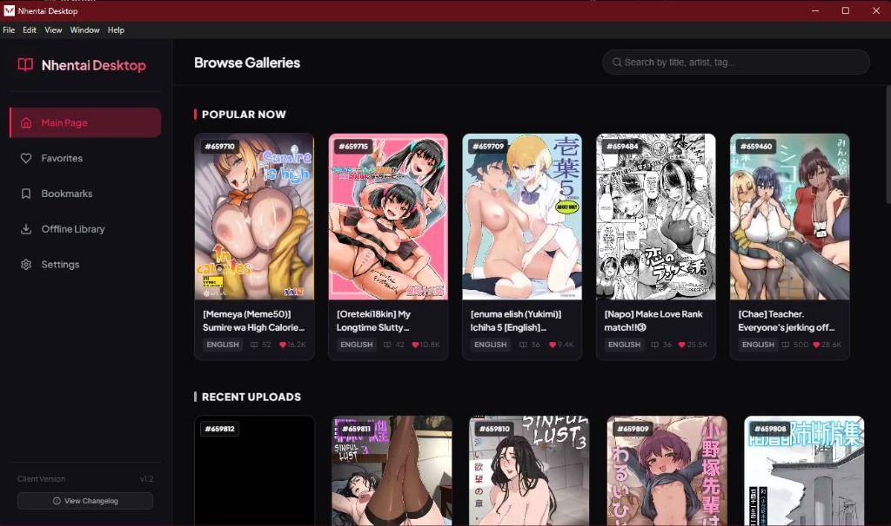

# NClient-Desktop 🌐🔒

An unofficial, premium desktop client for **NHentai** based on the popular Android client `maxwai/NClientV3`. Built with **React**, **Electron**, **TypeScript**, and **Vanilla CSS** featuring a gorgeous Obsidian dark glassmorphism user interface.



It features a robust **Censorship Bypass Architecture** that completely bypasses ISP-level DNS blocks programmatically, allowing you to access nHentai and its content securely without requiring a VPN.

---

## 🚀 Key Features

* **Anti-Censorship (Bypass DNS Blocks)**: 
  * Integrated **DNS-over-HTTPS (DoH)** resolver programmatically querying secure Cloudflare DNS Anycast IPs.
  * Custom protocol handler `nhentai-image://` intercepts image requests and routes them safely over DoH.
  * Programmatic **TLS SNI Spoofing** connection wrapping.
  * Embedded Chromium routing via `--host-resolver-rules` for Turnstile browser login modal.
* **Offline Library (Downloader)**:
  * Full-featured downloader with progressive tracking (percentage and status).
  * Control keys: **Pause**, **Resume**, **Cancel**, and **Delete** buttons.
  * Metadata preservation for offline reading mode.
  * **Export to PDF**: Generate clean, print-ready PDF files directly from offline galleries with live status trackers.
* **Smart Search Mechanics**:
  * Filtering by tag query exclusion (e.g. `-tagname`).
  * **Direct Numeric ID Search**: Enter an ID like `392812` and press **Enter** to open the detail card overlay directly.
* **Premium User Experience (UX)**:
  * **Obsidian Dark Theme**: Stunning design featuring curated color palettes, custom gradients, and glassmorphism overlays.
  * **Interactive Badges**: floating `#ID` badge on catalog cards copies ID to clipboard instantly with a success animation, blocking click propagation.
  * **Multi-Toast Stack**: Dynamic sliding stack notifications for download queues and system events.
  * **PIN startup Lock Screen**: Keep your library secure with a text password or a 4-digit PIN lock.
  * **Full Comments Support**: Read user feedback with role badges (Staff/Admin) and initials-colored avatar fallbacks.
  * **Favorites & Bookmarks**: Save favorite galleries locally or sync them online via secure DoH. Resumes exact reading coordinate offsets per book.

---

## 🛠️ Tech Stack

* **Frontend**: React 19, TypeScript, Vanilla CSS (Glassmorphism & Obsidian palettes)
* **Backend/Wrapper**: Electron 31, Node.js
* **Bundler/Compiler**: Vite 8, TypeScript Compiler (tsc)
* **Resolver**: Cloudflare Anycast DNS-over-HTTPS IPs (`https://1.1.1.1/dns-query`)
* **Packager**: electron-builder (produces single-file portable executables)

---

## 📦 Running & Building

### Prerequisites
* Node.js (v18 or newer recommended)

### Development Mode
Runs Vite development server and Electron hot-reload concurrently:
```bash
powershell -ExecutionPolicy Bypass -Command "npm start"
```

### Production Build & Compile
Compiles frontend bundle into HTML/JS/CSS assets:
```bash
powershell -ExecutionPolicy Bypass -Command "npm run build"
```

### Distribute / Standalone Package (.exe)
Compiles Vite assets and packages the app using `electron-builder`:
```bash
powershell -ExecutionPolicy Bypass -Command "npm run package"
```
The packed portable output will be exported to the `dist-build/` folder.

---

## 🤝 Acknowledgments
* [maxwai/NClientV3](https://github.com/maxwai/NClientV3) - Inspiration for NClient features and API structures.
* Cloudflare - Reliable Anycast DNS services.

---
*Disclaimer: This is an unofficial app developed purely for educational and personal convenience purposes. All content is hosted by nHentai.*
